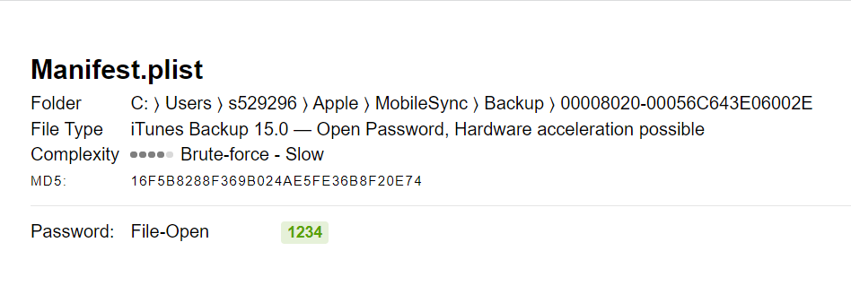

"The world leader in encrypted electronic evidence discovery and decryption.Password recovery tools for forensic teams, businesses and home office with up to 70% success rate." -Passware

# Digital Forensic Kit Workshop

The purpose of this workshop is to demo Passware Digital Forensic Kit to see what all passwords can be recovered from evidence, or in this case, made up evidence.

# Topics Covered

1.  [Decrypting Itunes backup using passwords found on the local machine](https://github.com/s529296/Passware-Digital-Forensic-Kit-Demo/blob/main/RecoveringICloudBackupPasswords.md). Presented by Noah Chase 
2.  [Decrypting different types of files and looking for passwords in memory](https://github.com/s529296/Passware-Digital-Forensic-Kit-Demo/blob/main/Praneeth). Presented by Praneeth Vallabhaneni

# Passware's Generated Report Example

Report taken from decrypting Itunes backup demo.

# Sources
1. [Passware's Website](https://www.passware.com/kit-forensic/)
2. [Getting Started With Passware Digital Forensic Kit](https://www.passware.com/kit-forensic/quickstart/)
