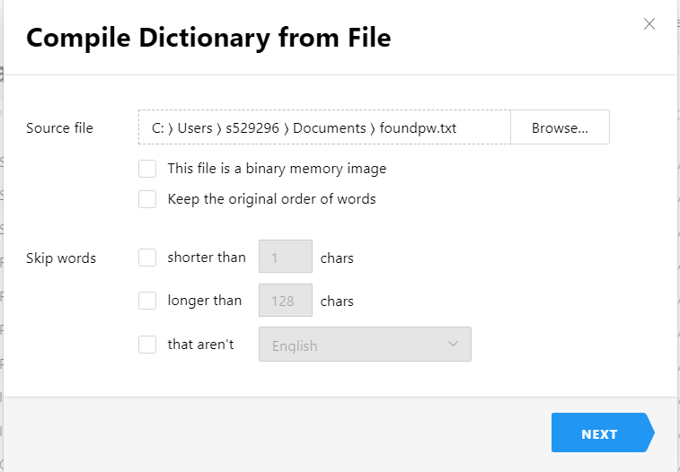
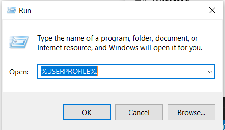
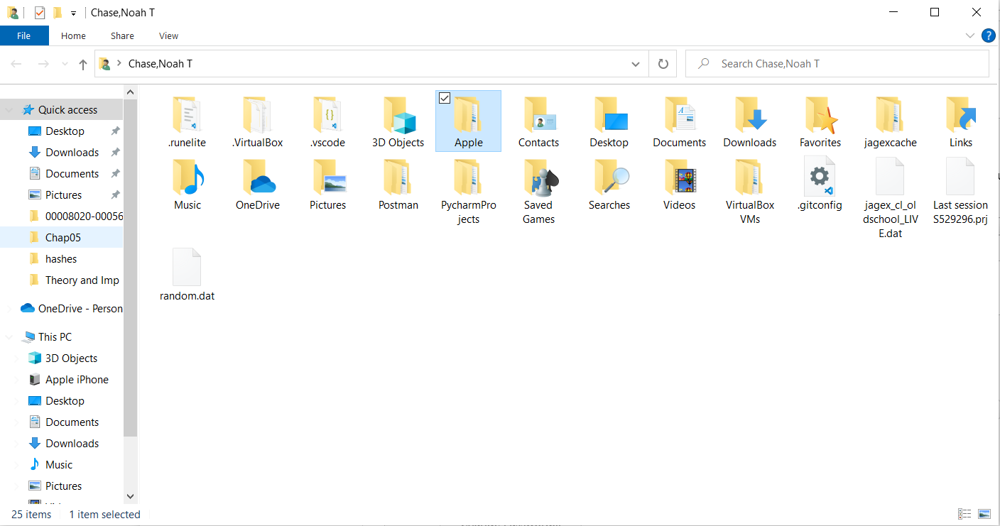
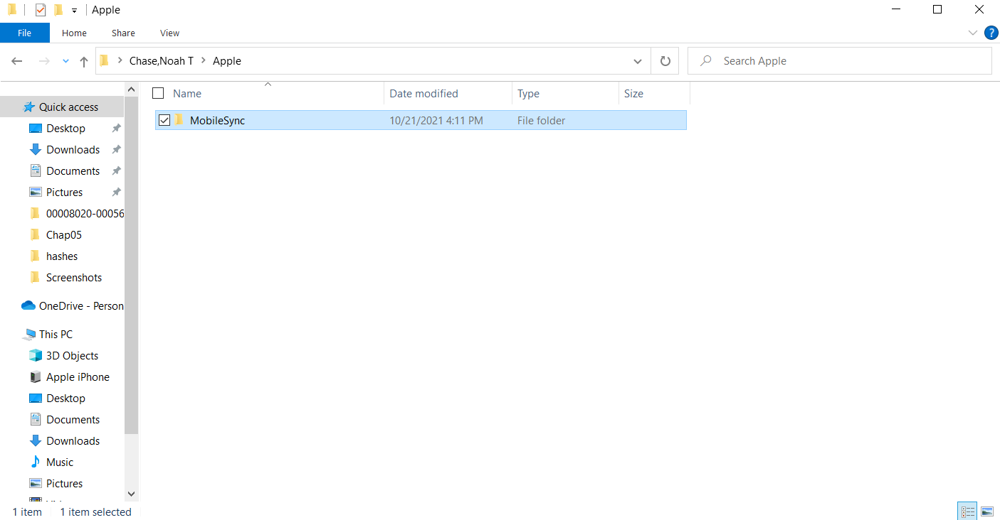
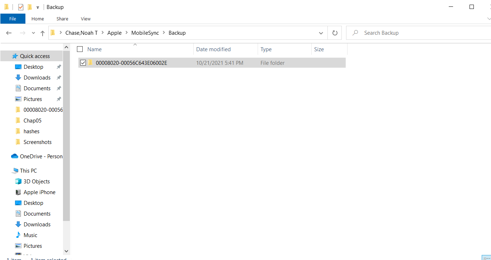
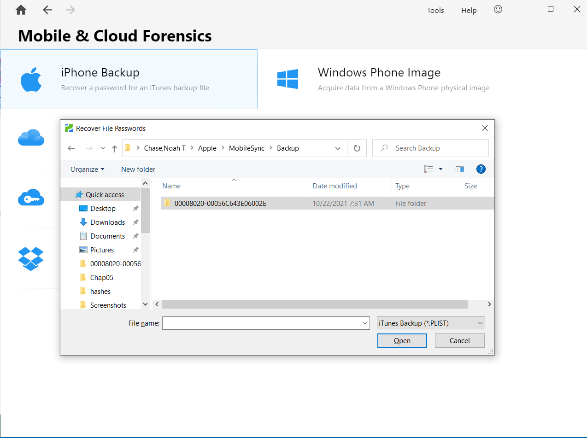
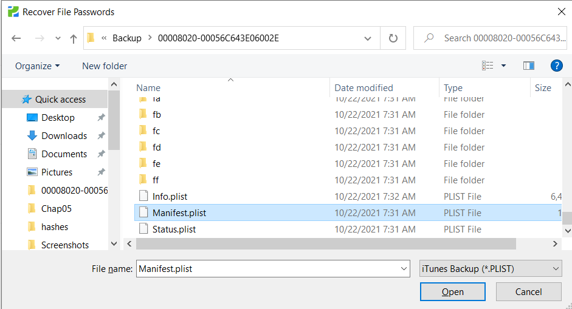
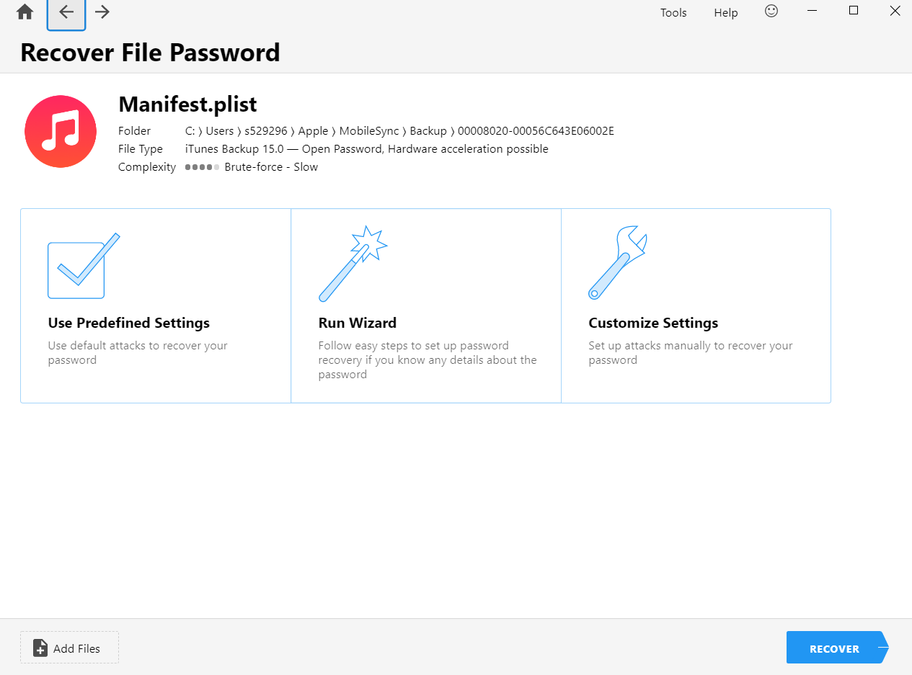
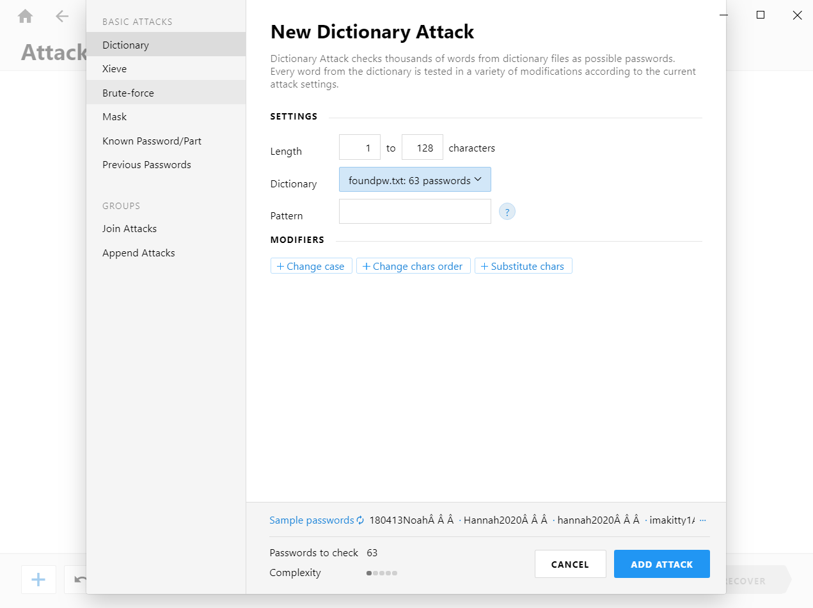
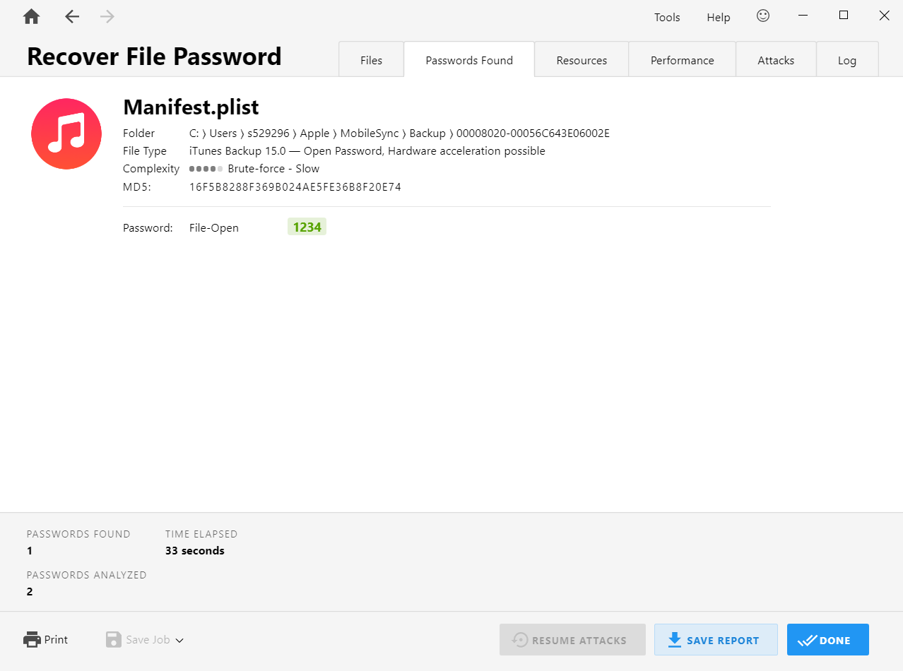

# Recovering Passwords From Icloud Backup File

The Goal of this demo was to attain any information from your computer that would allow you to decrypt an Itunes backup file from an Apple Device. This can be useful for extracting your own personal information or when investigating someone.

# Getting Icloud Backup From Itunes
Use the settings below to create a backup of your apple device, only if you do not have any backups on your machine.

# Finding Passwords Already On Your Machine And Saving Them To A Dictionary
Open Passware Digital Forensic Kit and select 'Internet and Network' from the home page.
     
Click on Websites and it should begin searching for any passwords stored by any internet browser on the local machine.

Copy and paste all the passwords it found on your machine into a text file and save it somewhere you can find it.
NOTE: Make sure you delete this file at the conclusion of the demo if you have current passwords saved in the text file.

Now go to the home screen of the Passware software and click 
'Dictionary Manager' under tools. A known passwords dictionary is allowed in the full version, so we are going to make our own dictionary of known passwords using the ones we found in the above steps.

Inside Dictionary Manager Click 'add dictionary' and use the below screenshot as a template for adding your found passwords as a dictionary

Once you have your dictionary of found passwords added, it can be used within the other passware tools and you are ready for the next step.

# Cracking Your Icloud Backup
Step one is to locate the itunes backup folder on your machine. Use the run command below and follow the screenshots to find your backup file location.

Keep the path for the directory available by copying it into your clipboard, or keeping the explorer window open so you can re-copy the file location into passware.

Now go to the home screen in your Passware software and select 'Mobile & Cloud Forensics'.
Once you are on 'Mobile & Cloud Forensics', select 'Iphone Backup'

Now use the path you found for your Icloud backups to select the 'Manifest.PLIST' of the backup you want to

Now select Customize Settings and Clear out all the default options.

Add a new dictionary attack using the found password dictionary we created earlier and begin attacking.

Crack Succesfull.
